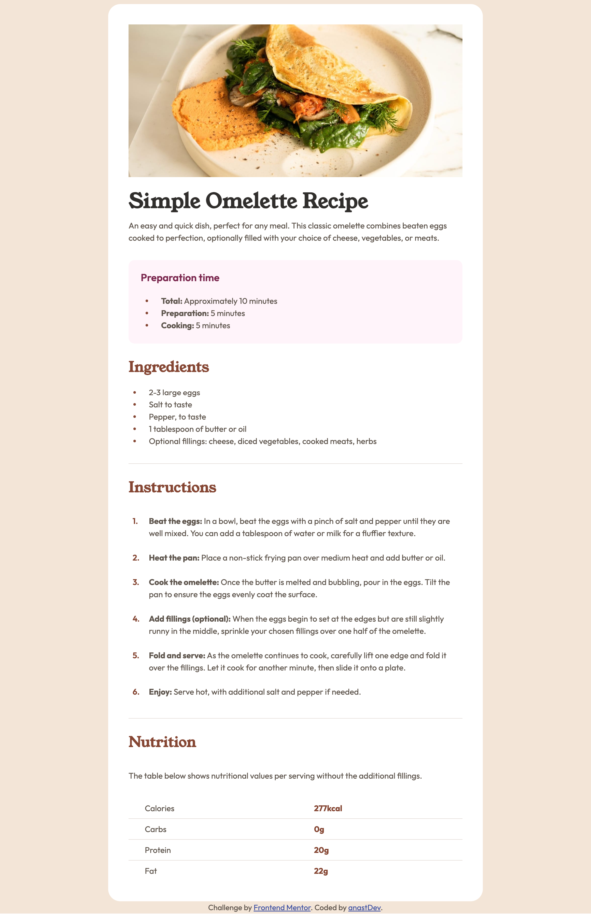

# Frontend Mentor - Recipe page solution

## Table of contents

- [Overview](#overview)
  - [The challenge](#the-challenge)
  - [Screenshot](#screenshot)
  - [Links](#links)
- [My process](#my-process)
  - [Built with](#built-with)
  - [What I learned](#what-i-learned)
  - [Useful resources](#useful-resources)
- [Author](#author)

## Overview

### Screenshot



### Links

- [Solution URL](https://github.com/anastDev/Recipe-Page.git)
- [Live Site URL](https://anastdev.github.io/Recipe-Page/)

## My process

### Built with

- Semantic HTML5 markup
- CSS Styling
- Responsive Design
- Flexbox
- Custom Lists
- CSS Grid
- Accessibility Considerations

### What I learned

Working through this project helped me strengthen my understanding of both HTML and CSS. Here are some of the key takeaways:

- Improved HTML Structuring:
  I learned how to better organize my HTML structure, using clear and semantic naming conventions. This made it easier to apply styles in CSS and keep the code maintainable.

- Custom Lists and Table Styling:
  I faced the challenge of styling `<ul>`, `<ol>`, and tables to fit within the design. This was a great exercise in using CSS pseudo-elements and custom styles to make these elements fit seamlessly into the overall layout.

- Custom Fonts with @font-face:
  One of the new techniques I experimented with was using @font-face to add custom fonts to my project. This allowed me to embed fonts directly into my styles without relying on external sources, improving the consistency and performance of the site. Here’s an example of how I added the fonts:

```
@font-face {
font-family: "Young Serif";
src: url("/assets/fonts/young-serif/YoungSerif-Regular.ttf") format("truetype");
font-weight: 400;
font-style: normal;
}
```

```
@font-face {
  font-family: "Outfit";
  src: url("/assets/fonts/outfit/Outfit-VariableFont_wght.ttf") format("truetype");
  font-weight: 400 700;
  font-style: normal;
}

```

This method made it easy to apply these fonts throughout the project and helped me ensure that the typography was consistent with the design.

### Useful resources

- [MDN Web Docs](https://developer.mozilla.org/en-US/docs/Web/CSS/CSS_box_model/Introduction_to_the_CSS_box_model) - A useful website for Developers.

## Author

- Frontend Mentor - [@anastDev](https://www.frontendmentor.io/profile/anastDev)
